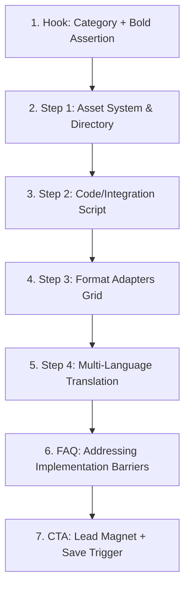

# Reference: Viral Brand Playbook Carousel

> **Source Post:** How to Use Claude for Brands (Instagram)
> **Author:** `@mobileeditingclub` (Source ID: `288e298c-99ba-4e67-91c4-c9d10763f31d`)
> **Engagement Score:** 121,278 (Likes: 56,590 | Comments: 64,688)
> **Core Format:** Educational Playbook / Step-by-Step System Breakdown

This reference documents the structure, copywriting formulas, and visual layout principles of a top-performing social carousel. Use this to construct or audit similar carousels.

---

## 1. Narrative Architecture (7 Slides)

The carousel follows a strict progressive disclosure flow that builds value before offering a call to action.

### Slide 1: The Hook (Cover)
* **Objective:** Capture attention with category positioning and a highly desirable assertion.
* **Copy:** `How to use Claude for Brands`
* **Thesis:** Stop treating it like a basic chatbot. Build automated systems that manage assets, Figma files, copy, and layout conversion.
* **Visual style:** Card mockup stack showcasing three dimensions of the system (e.g. Pack Shots, Figma templates, Multi-Language).

### Slide 2: Step 1 (Asset System)
* **Objective:** Establish authority by displaying structured organization (the "secret sauce" setup).
* **Headline:** `Generate All Pack Shots`
* **Copy:** Render product photography at scale automatically. Create pack shots for all your SKUs from identical angles, structured in your product asset directories.
* **Visual style:** Directory folder hierarchy showing nested logo assets, font files, and product packshot files.

### Slide 3: Step 2 (Figma Integration)
* **Objective:** Introduce technical complexity simply (the "how it works" phase).
* **Headline:** `Figma to Social Slides`
* **Copy:** Connect Figma layouts to distribution pipelines. Claude reads your template guidelines, feeds in copy, and outputs completed slides matching your brand guidelines.
* **Visual style:** A clean Python connector script mock block defining project paths, asset locations, and layout builders.

### Slide 4: Step 3 (Format Adapters)
* **Objective:** Visual demonstration of scale and flexibility.
* **Headline:** `Ad Variants in Seconds`
* **Copy:** Adjust format and copy simultaneously. Convert single creative inputs into platform-specific Feed (1:1), Portrait (4:5), Story/Reel (9:16), and Landscape (16:9) assets.
* **Visual style:** Aspect ratio grid showing visual representation of standard sizes.

### Slide 5: Step 4 (Multi-Language)
* **Objective:** Highlight global scalability.
* **Headline:** `Any Language, Instantly`
* **Copy:** Translate content copy, overlay it precisely onto correct canvas dimensions using local font weights, and export localized, launch-ready folders.
* **Visual style:** Speech bubbles rendering localized copy in German, Spanish, and Chinese with matching flags.

### Slide 6: FAQ (Implementation Guardrail)
* **Objective:** Pre-emptively answer the reader's primary doubt.
* **Question:** `How does Claude keep layouts consistent?`
* **Answer:** Enforce strict layout templates. Claude maps context into pre-defined container systems using ingested styles (fonts, colors, logos) rather than writing CSS code dynamically.
* **Visual style:** Tilted sticky note with a callout quote summarizing the template constraint.

### Slide 7: The CTA (Lead Magnet)
* **Objective:** Drive comments for automated DM delivery.
* **Headline:** `Save this post to your feed.`
* **Pill Trigger:** `Comment "Claude" to get our FREE Claude Guide!`
* **Visual style:** Large bookmark icon highlighting the save button, pill badges for topic tags, and a bold follow button.

---

## 2. Key Copywriting Formulas

1. **Category tag on hook:** Always place a small, uppercase category tag (e.g. `BRAND AUTOMATION PLAYBOOK`) above the main headline to establish immediate context.
2. **Action-oriented headlines:** Step titles must start with verbs: `Generate...`, `Connect...`, `Create...`, `Translate...`.
3. **Concise body text:** Slide descriptions must remain under **40 words**. Use bolding on key phrases to allow scanning.
4. **The Comment loop:** Integrate a high-value guide giveaway triggered by commenting a specific keyword (e.g., `"Comment 'CLAUDE' to get the guide"`).

---

## 3. Design Implementation Checklist

When generating HTML for this style (see [carousel-article](file:///Users/jeff/Documents/GitHub/trendingsociety/apps/open-design/skills/carousel-article/SKILL.md) instructions):
- [ ] Maintain a unified canvas of exactly `1080px x 1350px` per slide.
- [ ] Safe margin padding of at least `64px` horizontal and `80px` vertical.
- [ ] Left-align all content descriptions (never center body copy).
- [ ] Use a consistent brand handle (`@trendingsociety`) across all headers and footers.
- [ ] Ensure any code snippet mockup, folder structure, aspect ratios, or translation boxes use high-contrast outlines (`#2C2C2A`) and physical offsets (`box-shadow: 6px 8px 0px #2C2C2A`).
